# Mermaid 图代码

说明：
- 本文件用于集中存放可在 `https://mermaid.live/` 渲染的论文插图代码。
- 各图已按图号分节标注。
- `图 3-1` 已有成品图片，位于 `imgs/3-1.png`。
- `图 3-2` 已有成品图片，位于 `imgs/3-2.png`。
- 第 5 章界面截图类图片和 `图 4-7` 终端运行截图不适合 Mermaid，建议直接截图。

## 图 2-1 Scrapy 五大组件架构图

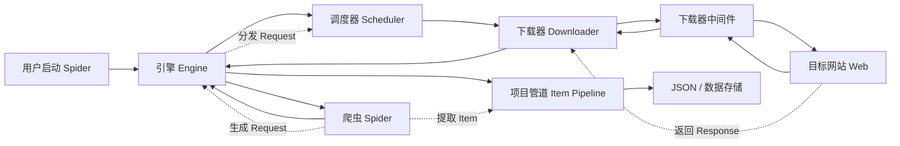

## 图 2-2 并发采集与容错机制层次图

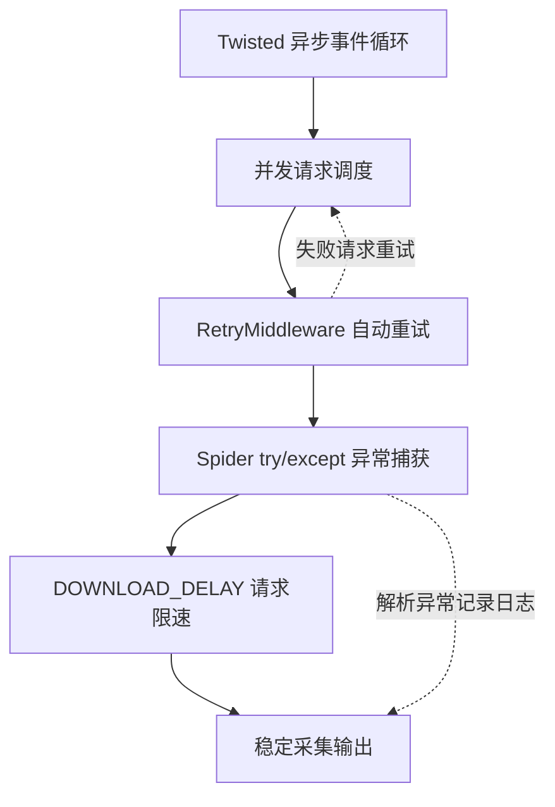

## 图 2-3 HTML 文本清洗流程图

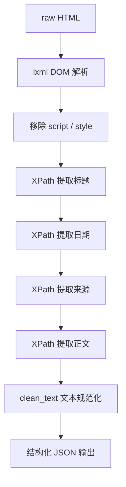

## 图 2-4 两阶段去重策略示意图

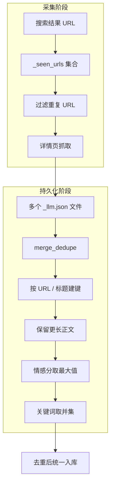

## 图 2-5 Jieba 分词与停用词过滤流程图

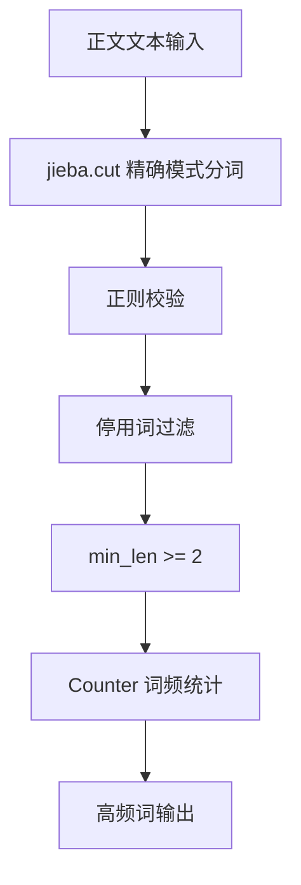

## 图 2-6 Qwen API 调用架构图

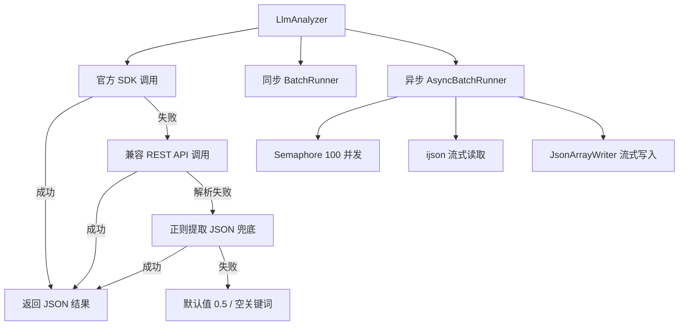

## 图 3-1 系统数据库 E-R 图

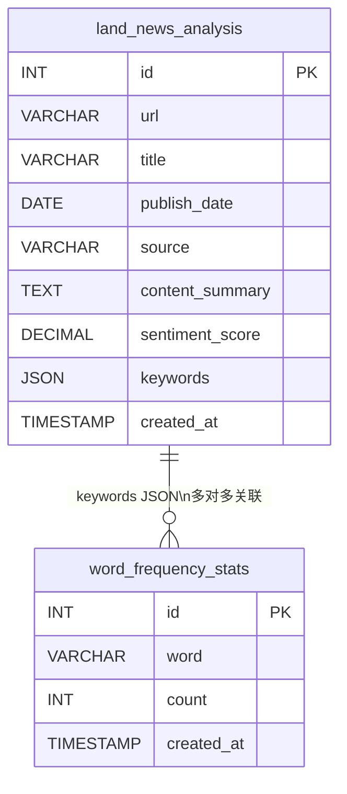

## 图 3-2 系统总体架构图

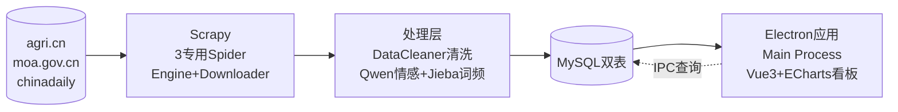

## 图 2-7 MySQL 数据库双表结构示意图

（已移至图 3-1）

## 图 3-3 系统技术选型总览图

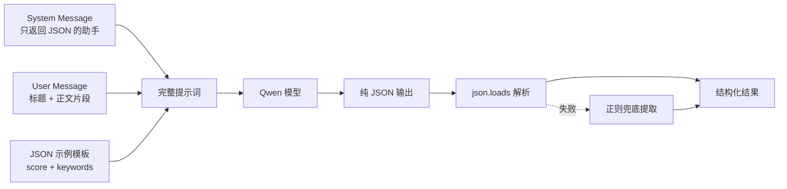

## 图 2-10 Electron 双进程架构图

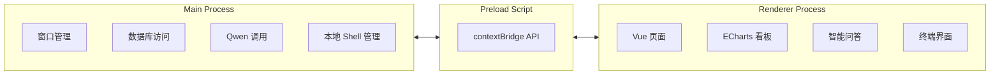

## 图 2-11 IPC 进程间通信示意图

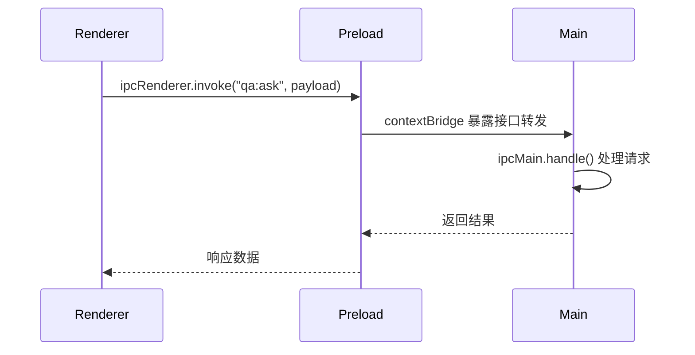

## 图 3-3 系统技术选型总览图

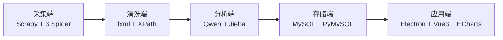

## 图 4-2 Scrapy 异常处理机制层次图

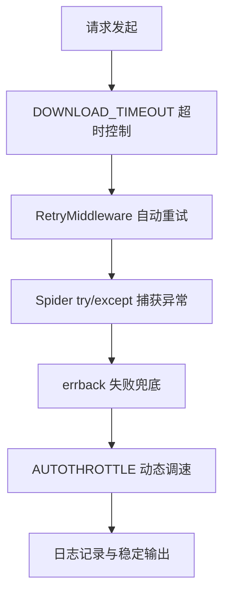

## 图 4-5 Jieba 词频统计流程图

```mermaid
flowchart TD
    A[clean.json 正文] --> B[jieba.cut 分词]
    B --> C[正则过滤]
    C --> D[停用词过滤]
    D --> E[Counter 计数]
    E --> F[most_common(300)]
    F --> G[word_frequency_top.json]
```

## 图 4-6 数据持久化入库流程图

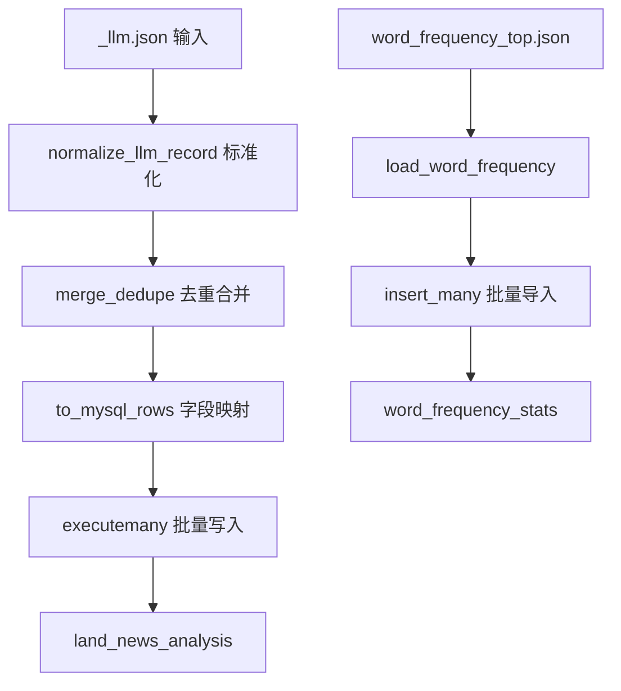

## 图 6-1 系统测试场景覆盖概览图

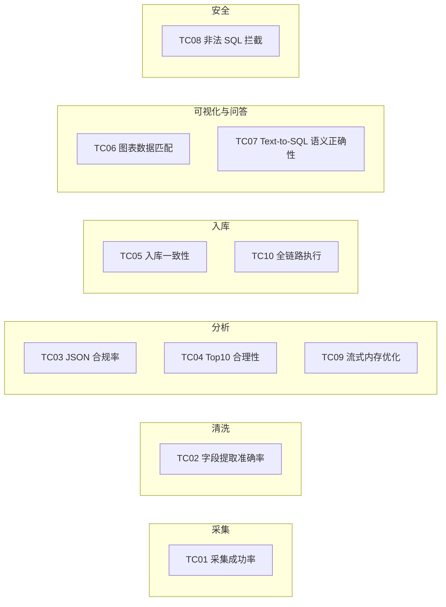
